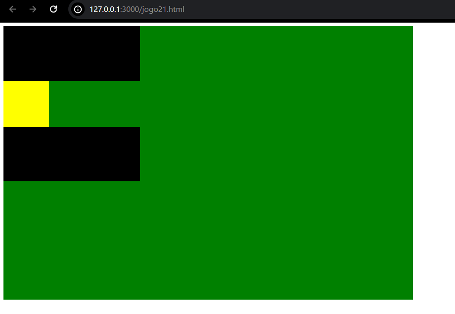
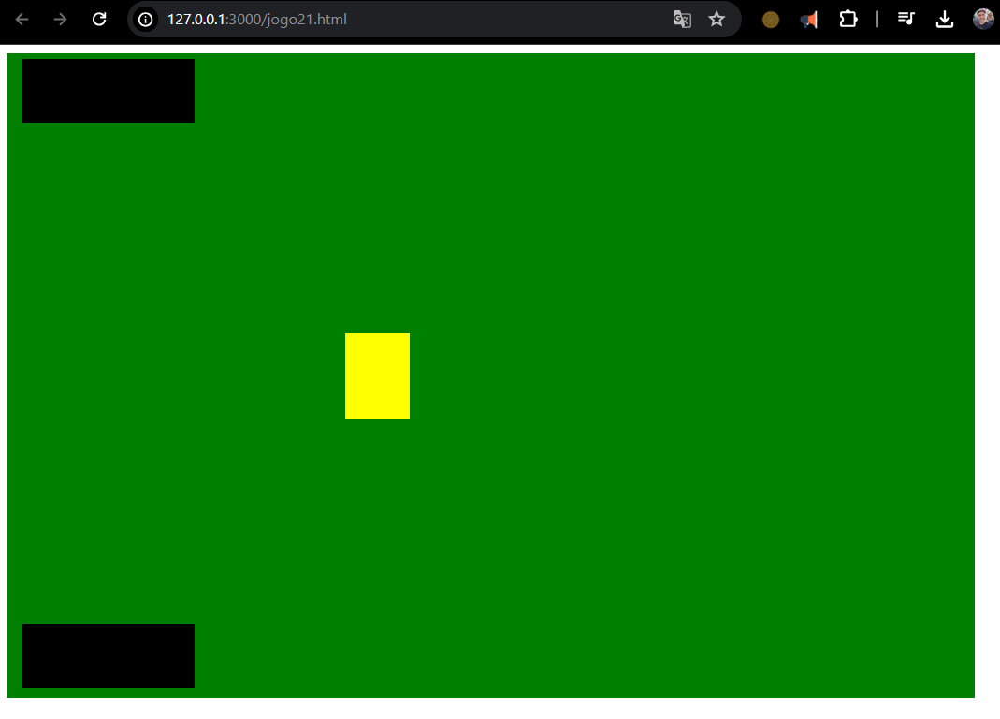

# Resultado
### (algo próximo disto)



isto para primeira parte em seguida o resultado com reposicionamento dos itens.

com o reposicionamento e ajuste tamanho  deve ficar parecido como abaixo:



<hr>

Agora vamos focar no estudo de como foi escrito o nosso CSS. (vejamos abaixo):

``` css
.mesa{
    position: fixed;
    width:900px;
    height:600px;
    background-color: green;
      }
.robot{
   position: relative;
   top:5px;
   left:15px;
   width:160px;
   height:60px;
   background-color: black;  }      
.jogador{
    position: relative;
    top:390px;
    left:15px;
    width:160px;
    height:60px;
    background-color: black; }   
.baralho{
    position: relative;
    top:200px;
    left:315px;
    width:60px;
    height:80px;
    background-color:yellow;}   
```
